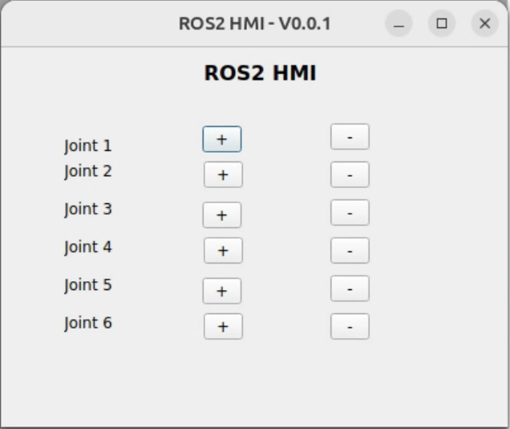

# ros2-hmi
HMI based on ROS2 to control the robot

## Dependencies

- Qt5
- ROS2

## Commands to build and run

```bash
rosdep install --from-paths src --ignore-src -r -y
colcon build --symlink-install
source install/setup.bash

ros2 launch ros2_hmi ros2_hmi.launch.py
```

## GUI



## License
MIT License